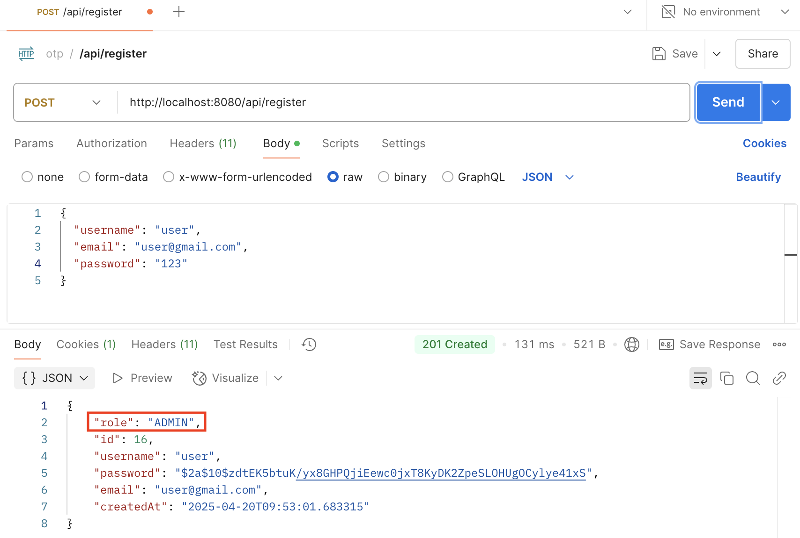
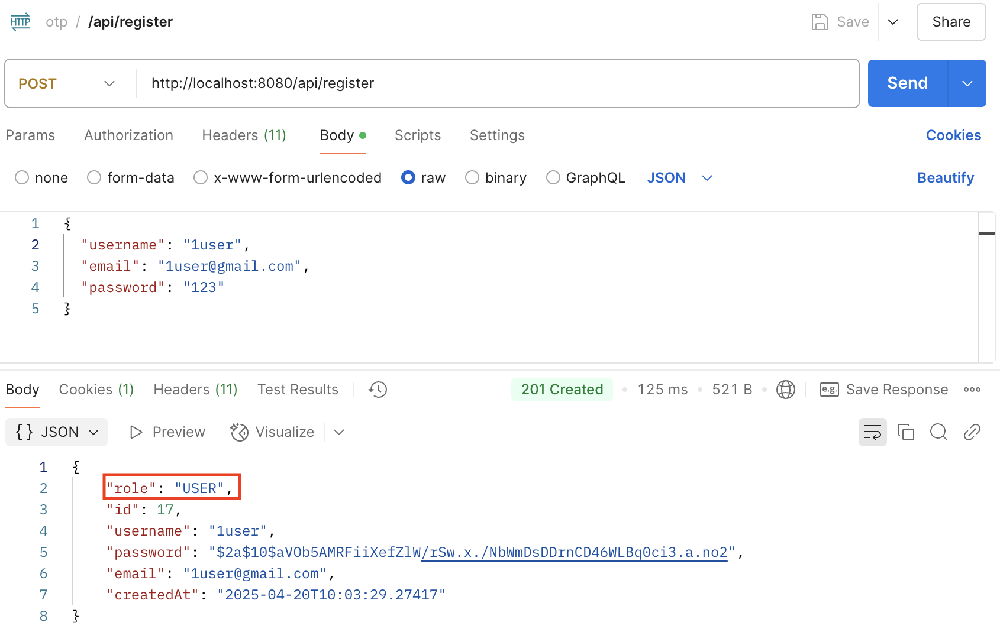
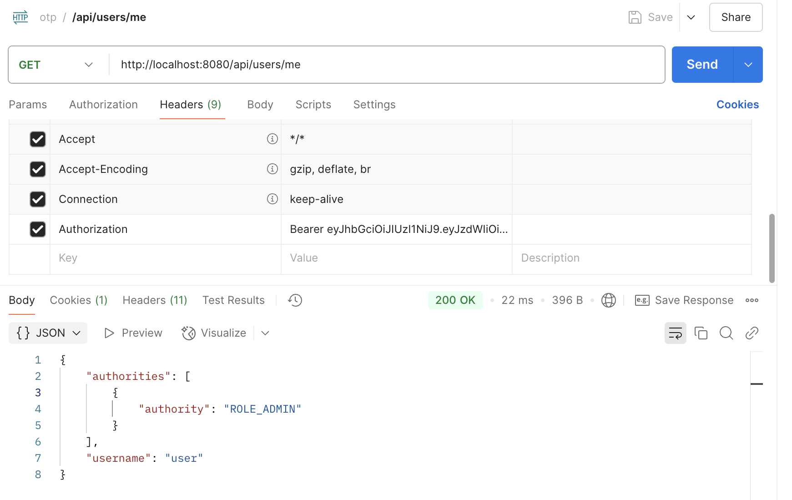
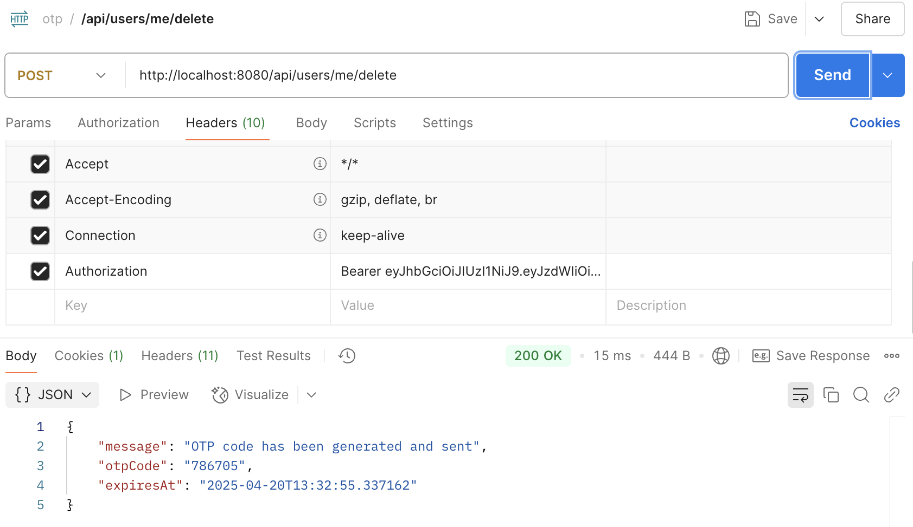
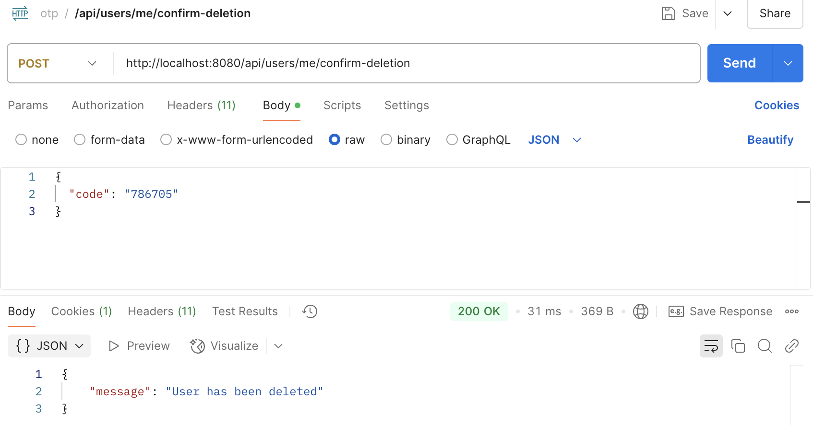
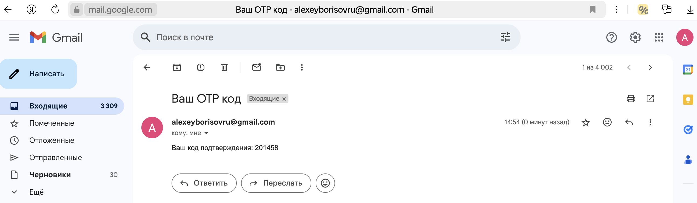
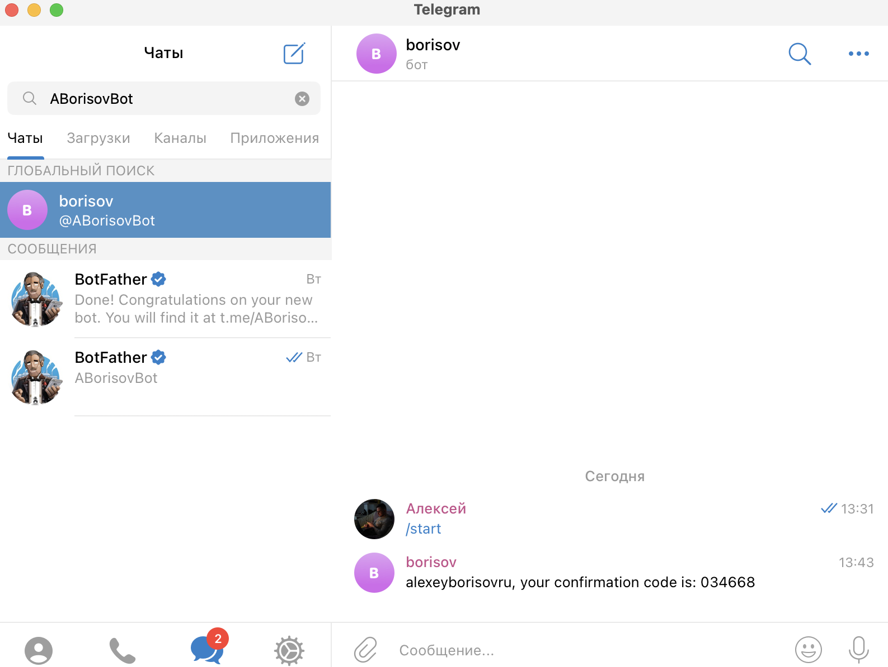

# Система защиты операций с помощью временных кодов

## Быстрый старт

1. Настройте подключение к базе данных PostgreSQL в файле `src/main/resources/application.properties`
2. Откройте файл `com/example/otp_security_service/OtpSecurityServiceApplication.java` в IDE IntelliJ IDEA
3. Выполните команду `RUN`

## Как пользоваться сервисом

### 1. Регистрация пользователя

Отправьте запрос методом `POST` по url `http://localhost:8080/api/register`

В теле запроса передайте `JSON`, содержащий имя пользователя, email и пароль.

Пример тела запроса:

```json
{
  "username": "user",
  "email": "user@gmail.com",
  "password": "user"
}
```
Пароль пользователя хранится в зашифрованном виде

Обратите внимание, что первому зарегистрированному пользователю будет присвоена роль `ADMIN`, а всем остальным - роль `USER`

#### Регистрация администратора


#### Регистрация пользователя


### 2. Авторизация и аутентификация

Для авторизации и аутентификации пользователя нужно отправить запрос методом `POST` по url `http://localhost:8080/api/auth/login`

В теле запроса передайте `JSON`, содержащий имя пользователя и пароль, указанные при регистрации.

Пример тела запроса:

```json
{
  "username": "user",
  "password": "123"
}
```

Данная операция возвращает токен с ограниченным сроком действия для осуществления аутентификации и авторизации пользователя.

Этот токен используется для доступа к страницам, требующим авторизации и передается в заголовке запроса как `Bearer-token` (`Authorization: Bearer <token>`)


### 3. Метод `API` требующий авторизации (`http://localhost:8080/api/users/me`)

Метод `API`, предусматривающий получение пользователем информации о себе требует авторизации

Для получения доступа к этому методу необходимо:

1) отправить запрос методом `GET` по url `http://localhost:8080/api/users/me`

2) передать в заголовке запроса `Bearer-token`, который был получен на этапе авторизации (`Authorization: Bearer <token>`)

#### Пример успешного ответа:



### 4. Удаление пользователя (`http://localhost:8080/api/users/me/delete`)

Необходимо отправить запрос методом `POST` по url `http://localhost:8080/api/users/me/delete`

Метод `API` требует авторизации пользователя с помощью `Bearer-token`

Для удаления пользователя требуется подтверждение операции удаления пользователя с помощью OTP-кода



### 5. Подтверждение операции удаления пользователя с помощью OTP-кода (`http://localhost:8080/api/users/me/confirm-deletion`)

Необходимо отправить запрос методом `POST` по url `http://localhost:8080/api/users/me/confirm-deletion`

В теле запроса передайте `JSON`, содержащий OTP-код.

Пример тела запроса:

```json
{
  "code": "786705"
}
```

Метод `API` требует авторизации пользователя с помощью `Bearer-token`



### 6. Отправка OTP-кода на email пользователя

Для проверки необходимо добавить параметры smtp-сервера в файле `src/main/resources/email.properties`

Реализована проверка доступности smtp-сервера

Письмо будет отправлено на электронную почту пользователя, указанную при регистрации только в случае правильной настройки параметров в файле `src/main/resources/email.properties` и доступности smtp-сервера

Пример письма с кодом:



### 7. Отправка OTP-кода по смс на номер телефона пользователя

### 8. Отправка OTP-кода в Телеграм-чат

Для проверки необходимо добавить параметры Телеграма в файле `src/main/resources/telegram.properties`

Реализована проверка указания необходимых параметров Телеграм

Если не указаны необходимые параметры Телеграм, в консоли будет выведено сообщение "Telegram settings are missing. Message not sent."

Пример сообщения с кодом:


### 9. Сохранение OTP-кодов в файл

Сгенерированные OTP-коды сохраняются в файл `otp_codes.txt`

Пример файла с кодами:


## Какие команды поддерживаются

## Как протестировать код