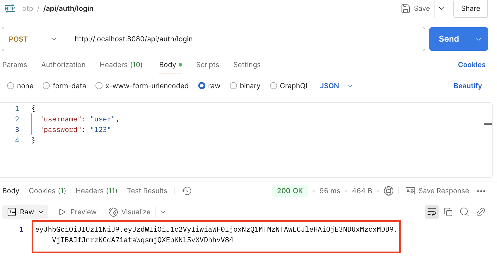

# Система защиты операций с помощью временных кодов

## Быстрый старт

1. Настройте подключение к базе данных PostgreSQL в файле `src/main/resources/application.properties`
2. Откройте файл `com/example/otp_security_service/OtpSecurityServiceApplication.java` в IDE IntelliJ IDEA
3. Выполните команду `RUN`

## Как пользоваться сервисом

### 1. Регистрация пользователя

Отправьте запрос методом `POST` по url `http://localhost:8080/api/register`

В теле запроса передайте `JSON`, содержащий имя пользователя, email и пароль.

Пример тела запроса:

```json
{
  "username": "user",
  "email": "user@gmail.com",
  "password": "user"
}
```
Пароль пользователя хранится в зашифрованном виде

Обратите внимание, что первому зарегистрированному пользователю будет присвоена роль `ADMIN`, а всем остальным - роль `USER`

#### Регистрация администратора


#### Регистрация пользователя


### 2. Авторизация и аутентификация

Для авторизации и аутентификации пользователя нужно отправить запрос методом `POST` по url `http://localhost:8080/api/auth/login`

В теле запроса передайте `JSON`, содержащий имя пользователя и пароль, указанные при регистрации.

Пример тела запроса:

```json
{
  "username": "user",
  "password": "123"
}
```

Данная операция возвращает токен с ограниченным сроком действия для осуществления аутентификации и авторизации пользователя.

Этот токен используется для доступа к страницам, требующим авторизации и передается в заголовке запроса как `Bearer-token` (`Authorization: Bearer <token>`)



## Какие команды поддерживаются

## Как протестировать код